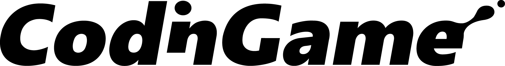

# 

## What is this place about ?

[**Codingame**](https://www.codingame.com/training) is an online platform offering ressources for developpers to developp their skills in a ludic way.

It includes 

* [**puzzles**](https://www.codingame.com/training) **_ordered_** by difficulty and **_labelled_** with the concept you may need to solve them.
    
* [**code golf**](https://www.codingame.com/multiplayer/codegolf) - **_Solve puzzles_** with the shortest possible code.
    
* [**bot fights**](https://www.codingame.com/multiplayer/bot-programming) - **_Compete_** in multiplayers programming contests involving artificial intelligence.
    
* [**Clash of codes**](https://www.codingame.com/multiplayer/clashofcode) - **_Challenge_** yourself and be the first to complete a puzzle in 15-minutes
